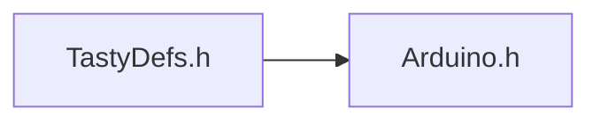
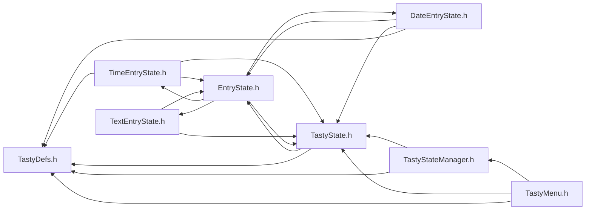

<a id="_tasty_defs_8h"></a>
# File TastyDefs.h

![][C++]

**Location**: `include/TastyDefs.h`


## Classes

* [DateTimeObj](struct_date_time_obj.md#struct_date_time_obj)
* [LedColor](struct_led_color.md#struct_led_color)
* [RGBLed](struct_r_g_b_led.md#struct_r_g_b_led)
* [ActionFunctions](struct_action_functions.md#struct_action_functions)
* [eventHandler](structevent_handler.md#structevent_handler)
* [BlinkState](struct_blink_state.md#struct_blink_state)

## Includes

* <Arduino.h>



## Included by

* <DateEntryState.cpp>
* <DateEntryState.h>
* [TastyMenu.h](_tasty_menu_8h.md#_tasty_menu_8h)
* <TastyState.h>
* [TastyStateManager.h](_tasty_state_manager_8h.md#_tasty_state_manager_8h)
* <TimeEntryState.h>



## Macros

<a id="_tasty_defs_8h_1a62486102324ad2f7185279ce943e3152"></a>
### Macro NOT\_A\_PIN

![][public]

```cpp
#define NOT_A_PIN -1
```


## Enumeration types

<a id="_tasty_defs_8h_1aab6b50cd48c7a2b548e5f596b3873edb"></a>
### Enumeration type BlinkSpeed

![][public]

**Definition**: `include/TastyDefs.h` (line 61)

```cpp
enum BlinkSpeed {
  LED_OFF,
  LED_SLOW,
  LED_MODERATE,
  LED_FAST,
  LED_ULTRA,
  LED_STEADY
}
```


<a id="_tasty_defs_8h_1aab6b50cd48c7a2b548e5f596b3873edbafc0ca8cc6cbe215fd3f1ae6d40255b40"></a>
#### Enumerator LED\_OFF


<a id="_tasty_defs_8h_1aab6b50cd48c7a2b548e5f596b3873edbaa090070bc6423eb8f35bfd10e000b34a"></a>
#### Enumerator LED\_SLOW


<a id="_tasty_defs_8h_1aab6b50cd48c7a2b548e5f596b3873edba6fd836e11c7d4514014e6e2770bd89db"></a>
#### Enumerator LED\_MODERATE


<a id="_tasty_defs_8h_1aab6b50cd48c7a2b548e5f596b3873edba8c6723ae6f24b07d5291d006d2f4c711"></a>
#### Enumerator LED\_FAST


<a id="_tasty_defs_8h_1aab6b50cd48c7a2b548e5f596b3873edba4544fc3f2ff0bd6b0b4b721c4e5ae991"></a>
#### Enumerator LED\_ULTRA


<a id="_tasty_defs_8h_1aab6b50cd48c7a2b548e5f596b3873edbac1dd810f372fcdae2b9481585c854a1b"></a>
#### Enumerator LED\_STEADY


<a id="_tasty_defs_8h_1ac0d6bc6594dc87bb21738b8e364a8341"></a>
### Enumeration type TastyEventType

![][public]

**Definition**: `include/TastyDefs.h` (line 82)

```cpp
enum TastyEventType {
  ENTER = 0,
  TICK = 1,
  LEAVE = 2,
  UP = 3,
  DOWN = 4,
  RIGHT = 5,
  LEFT = 6,
  CLICK = 7,
  DOUBLE_CLICK = 8,
  MULTI_CLICK = 9,
  LONG_CLICK = 10,
  TIMEOUT = 11
}
```


<a id="_tasty_defs_8h_1ac0d6bc6594dc87bb21738b8e364a8341a331b3100a485d8cacff1d3df8e9b0c13"></a>
#### Enumerator ENTER


<a id="_tasty_defs_8h_1ac0d6bc6594dc87bb21738b8e364a8341a1de1c752385bf565da9d1ca8e85b58f0"></a>
#### Enumerator TICK


<a id="_tasty_defs_8h_1ac0d6bc6594dc87bb21738b8e364a8341ae0f9ef6d3025baf33497bafcca7ff781"></a>
#### Enumerator LEAVE


<a id="_tasty_defs_8h_1ac0d6bc6594dc87bb21738b8e364a8341afbaedde498cdead4f2780217646e9ba1"></a>
#### Enumerator UP


<a id="_tasty_defs_8h_1ac0d6bc6594dc87bb21738b8e364a8341ac4e0e4e3118472beeb2ae75827450f1f"></a>
#### Enumerator DOWN


<a id="_tasty_defs_8h_1ac0d6bc6594dc87bb21738b8e364a8341a21507b40c80068eda19865706fdc2403"></a>
#### Enumerator RIGHT


<a id="_tasty_defs_8h_1ac0d6bc6594dc87bb21738b8e364a8341a684d325a7303f52e64011467ff5c5758"></a>
#### Enumerator LEFT


<a id="_tasty_defs_8h_1ac0d6bc6594dc87bb21738b8e364a8341a40600390b96d1c218ae0d475f977e25b"></a>
#### Enumerator CLICK


<a id="_tasty_defs_8h_1ac0d6bc6594dc87bb21738b8e364a8341a43236a8437f1089d1b5bd1576fc7b6b5"></a>
#### Enumerator DOUBLE\_CLICK


<a id="_tasty_defs_8h_1ac0d6bc6594dc87bb21738b8e364a8341a4e51b732285ce6603ee93f13a9169b55"></a>
#### Enumerator MULTI\_CLICK


<a id="_tasty_defs_8h_1ac0d6bc6594dc87bb21738b8e364a8341ae558133cfdfce66c4dee9662be3639ad"></a>
#### Enumerator LONG\_CLICK


<a id="_tasty_defs_8h_1ac0d6bc6594dc87bb21738b8e364a8341a070a0fb40f6c308ab544b227660aadff"></a>
#### Enumerator TIMEOUT


## Typedefs

<a id="_tasty_defs_8h_1a8bb84b5c51f63deb5eb08ac81e8977ac"></a>
### Typedef ActionFunction

![][public]

**Definition**: `include/TastyDefs.h` (line 43)

```cpp
typedef bool(* ActionFunction) ()
```


**Return type**: bool(*

<a id="_tasty_defs_8h_1a4688f2a3a6c8f0508169d10a5d036000"></a>
### Typedef T

![][public]

**Definition**: `include/TastyDefs.h` (line 50)

```cpp
typedef void* T
```


**Return type**: void *

<a id="_tasty_defs_8h_1a7d022f28028b1ac9f960f4a7e7386cf8"></a>
### Typedef handler\_t

![][public]

**Definition**: `include/TastyDefs.h` (line 51)

```cpp
typedef bool(* handler_t) (TastyState *state, T opaque)
```


**Return type**: bool(*

## Variables

<a id="_tasty_defs_8h_1a7ba53dff5b14c361de74e970a66df810"></a>
### Variable LED\_RED

![][public]

**Definition**: `include/TastyDefs.h` (line 28)

```cpp
LedColor LED_RED
```


**Type**: [LedColor](struct_led_color.md#struct_led_color)

<a id="_tasty_defs_8h_1aea6819032486feea16e83183ab9fdd38"></a>
### Variable LED\_ORANGE

![][public]

**Definition**: `include/TastyDefs.h` (line 29)

```cpp
LedColor LED_ORANGE
```


**Type**: [LedColor](struct_led_color.md#struct_led_color)

<a id="_tasty_defs_8h_1a5bfd2a5a80ca39fabb52e1d410d8f980"></a>
### Variable LED\_YELLOW

![][public]

**Definition**: `include/TastyDefs.h` (line 30)

```cpp
LedColor LED_YELLOW
```


**Type**: [LedColor](struct_led_color.md#struct_led_color)

<a id="_tasty_defs_8h_1a110aafbb151eb4c36c87dbda3c3f7eaf"></a>
### Variable LED\_GREEN

![][public]

**Definition**: `include/TastyDefs.h` (line 31)

```cpp
LedColor LED_GREEN
```


**Type**: [LedColor](struct_led_color.md#struct_led_color)

<a id="_tasty_defs_8h_1a86fddb6d4b61f518c7f603280ecf9598"></a>
### Variable LED\_TEAL

![][public]

**Definition**: `include/TastyDefs.h` (line 32)

```cpp
LedColor LED_TEAL
```


**Type**: [LedColor](struct_led_color.md#struct_led_color)

<a id="_tasty_defs_8h_1a85d3081f2292ade27dbf73eba4414daa"></a>
### Variable LED\_BLUE

![][public]

**Definition**: `include/TastyDefs.h` (line 33)

```cpp
LedColor LED_BLUE
```


**Type**: [LedColor](struct_led_color.md#struct_led_color)

<a id="_tasty_defs_8h_1a0457d0cd29fa55a9bac9e7c367e7bc93"></a>
### Variable LED\_PURPLE

![][public]

**Definition**: `include/TastyDefs.h` (line 34)

```cpp
LedColor LED_PURPLE
```


**Type**: [LedColor](struct_led_color.md#struct_led_color)

<a id="_tasty_defs_8h_1a6b3a268faadf21e252cea97c809e32e9"></a>
### Variable LED\_WHITE

![][public]

**Definition**: `include/TastyDefs.h` (line 35)

```cpp
LedColor LED_WHITE
```


**Type**: [LedColor](struct_led_color.md#struct_led_color)

<a id="_tasty_defs_8h_1a1365b7db892a3f72af1ad360efa9877c"></a>
### Variable icon\_empty

![][public]

**Definition**: `include/TastyDefs.h` (line 57)

```cpp
const unsigned char icon_empty[][]
```


**Type**: const unsigned char

<a id="_tasty_defs_8h_1a78294f7f940fde09dd0a4580241669a5"></a>
### Variable blinkSpeedValues

![][public]

**Definition**: `include/TastyDefs.h` (line 79)

```cpp
int16_t blinkSpeedValues[6][6]
```

Blink speed values in milliseconds.


**Type**: int16_t

## Source

```cpp
#ifndef TASTY_DEFS_H
#define TASTY_DEFS_H

#include <Arduino.h>
class TastyState;

#ifndef NOT_A_PIN
#define NOT_A_PIN -1
#endif

struct DateTimeObj {
    uint8_t hour;
    uint8_t minute;
    uint8_t second = 0;
    uint8_t month;
    uint8_t day;
    uint16_t year;
};

// -----------------------------
// LED
// -----------------------------
struct LedColor {
    uint8_t r;
    uint8_t g;
    uint8_t b;
};
extern LedColor LED_RED;    // = { 255, 0, 0 };
extern LedColor LED_ORANGE; // = { 255, 175, 0 };
extern LedColor LED_YELLOW; // = { 255, 255, 0 };
extern LedColor LED_GREEN;  // = { 0, 255, 0 };
extern LedColor LED_TEAL;   // = { 0, 255, 255 };
extern LedColor LED_BLUE;   // = { 0, 0, 255 };
extern LedColor LED_PURPLE; // = { 255, 0, 255 };
extern LedColor LED_WHITE; // = { 255, 255, 255 };

struct RGBLed {
    int8_t r = NOT_A_PIN;
    int8_t g = NOT_A_PIN;
    int8_t b = NOT_A_PIN;
};

typedef bool (*ActionFunction)();
struct ActionFunctions {
    ActionFunction onEnter = nullptr;
    ActionFunction onTick = nullptr;
    ActionFunction onLeave = nullptr;
};

typedef void* T;
typedef bool (*handler_t)(TastyState* state, T opaque); /* task handler func signature */
struct eventHandler {
    handler_t callback = nullptr;
    void* param = T();
};

extern const unsigned char icon_empty[];


enum BlinkSpeed {
    LED_OFF,
    LED_SLOW,
    LED_MODERATE,
    LED_FAST,
    LED_ULTRA,
    LED_STEADY
};

struct BlinkState {
    unsigned long onTime = 0;
    unsigned long offTime = 0;
    bool on = false;
    BlinkSpeed speed = LED_OFF;
    bool blinking = false;
    LedColor color = { 0, 0, 1 };
};

extern int16_t blinkSpeedValues[6]; // = { 0, 1000, 500, 250, 50, 1 };


enum class TastyEventType {
    ENTER = 0,
    TICK = 1,
    LEAVE = 2,
    UP = 3,
    DOWN = 4,
    RIGHT = 5,
    LEFT = 6,
    CLICK = 7,
    DOUBLE_CLICK = 8,
    MULTI_CLICK = 9,
    LONG_CLICK = 10,
    TIMEOUT = 11
};


#endif
```

[public]: https://img.shields.io/badge/-public-brightgreen (public)
[C++]: https://img.shields.io/badge/language-C%2B%2B-blue (C++)
[static]: https://img.shields.io/badge/-static-lightgrey (static)
[private]: https://img.shields.io/badge/-private-red (private)
[Markdown]: https://img.shields.io/badge/language-Markdown-blue (Markdown)