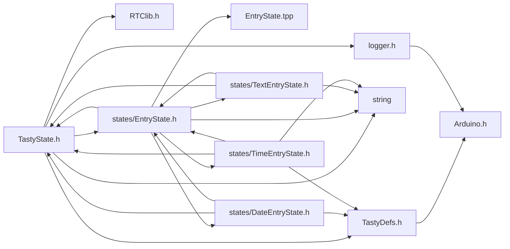
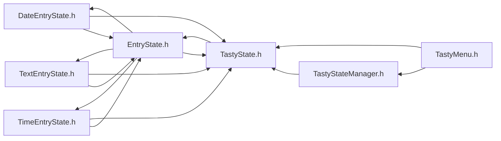

<a id="_tasty_state_8h"></a>
# File TastyState.h

![][C++]

**Location**: `include/TastyState.h`


## Classes

* [TastyState](class_tasty_state.md#class_tasty_state)

## Includes

* <TastyDefs.h>
* <string>
* <logger.h>
* RTClib.h
* [states/EntryState.h](_entry_state_8h.md#_entry_state_8h)



## Included by

* <DateEntryState.h>
* <EntryState.h>
* [TastyMenu.h](_tasty_menu_8h.md#_tasty_menu_8h)
* [TastyState.cpp](_tasty_state_8cpp.md#_tasty_state_8cpp)
* [TastyStateManager.h](_tasty_state_manager_8h.md#_tasty_state_manager_8h)
* <TextEntryState.h>
* <TimeEntryState.h>



## Macros

<a id="_tasty_state_8h_1a32f4fa9c1d13106861c4a328796e7d99"></a>
### Macro LOG\_STATE

![][public]

```cpp
#define LOG_STATE logdbg(state != nullptr ? "    " name ": %s" : "    " name ": nullptr", state != nullptr ? state->name : "")( name ,state )
```


## Variables

<a id="_tasty_state_8h_1a70e1bdabd42ba28937c01ccddde0a157"></a>
### Variable EMPTY\_STATE

![][public]

**Definition**: `include/TastyState.h` (line 172)

```cpp
TastyState* EMPTY_STATE
```

A default empty state instance of [TastyState](class_tasty_state.md#class_tasty_state).


**Type**: [TastyState](class_tasty_state.md#class_tasty_state) *

## Source

```cpp
#ifndef TASTY_STATES_H_
#define TASTY_STATES_H_

#define LOG_STATE(name, state) logdbg(state != nullptr ? "    " name ": %s" : "    " name ": nullptr", state != nullptr ? state->name : "")

#include <TastyDefs.h>
#include <string>
#include <logger.h>
#include "RTClib.h"

class TastyMenu;

class TastyState {
private:
    eventHandler events[12]; 
public:
    static int32_t defaultTimeout; 

    String name; 
    int8_t icon = -1; 

    LedColor ledColor = { 0, 0, 0 }; 
    BlinkSpeed ledSpeed = LED_OFF; 
    int32_t timeout = 0; 
    unsigned long activatedTime = 0; 

    // Event States
    TastyState* onClickState = nullptr; 
    TastyState* onDoubleClickState = nullptr; 
    TastyState* onLongPressState = nullptr; 
    TastyState* onMultiClickState = nullptr; 
    TastyState* onUpClickState = nullptr; 
    TastyState* onDownClickState = nullptr; 
    TastyState* onLeftClickState = nullptr; 
    TastyState* onRightClickState = nullptr; 
    TastyState* onTimeoutState = nullptr; 

    // Menu States
    int8_t index = -1; 
    // TastyState* previousState = nullptr; ///< Previous state in the menu list.
    // TastyState* nextState = nullptr; ///< Next state in the menu list.
    TastyMenu* backMenu = nullptr; 
    TastyMenu* forwardMenu = nullptr; 
    TastyMenu* menu = nullptr; 

    TastyState(String name, int8_t icon = -1, LedColor ledColor = { 0, 0, 0 }, BlinkSpeed ledSpeed = LED_OFF, int32_t timeout = 0, TastyState* timeoutState = nullptr)
        : name{ name }, icon{ icon }, ledColor{ ledColor }, ledSpeed{ ledSpeed }, timeout{ timeout }, onTimeoutState{ timeoutState } {}

    TastyState(TastyState* state, TastyState* timeoutS = nullptr) {
        name = state->name;
        icon = state->icon;
        ledColor = state->ledColor;
        ledSpeed = state->ledSpeed;
        timeout = state->timeout;
        // We don't want to copy the states.
        onTimeoutState = timeoutS;
    }

    void setLEDColor(int8_t r, int8_t g, int8_t b);


    void setLEDColor(LedColor color);

    void setBlinkSpeed(BlinkSpeed ledSpeed);

    inline int32_t getTimeout() { return timeout; }

    inline void setTimeout(int32_t to) { timeout = to; }

    void addEvents(TastyState* clickState, TastyState* doubleClickState = nullptr, TastyState* multiClickState = nullptr, TastyState* longPressState = nullptr);

    void onEvent(TastyEventType type, handler_t fn, void* param = T());

    bool handleEvent(TastyEventType type);

    bool forwardEvents(ActionFunction fn);

    void print();
};

// Example usage of TastyState class
/*
TastyState mainMenu("Main Menu", 1, {255, 0, 0}, LED_SLOW, 5000);
TastyState settingsMenu("Settings", 2, {0, 255, 0}, LED_OFF, 3000, &mainMenu);
mainMenu.addEvents(&settingsMenu);
mainMenu.setLEDColor(0, 0, 255);
mainMenu.print();
*/

#include "states/EntryState.h"

extern TastyState* EMPTY_STATE;
#endif
```

[public]: https://img.shields.io/badge/-public-brightgreen (public)
[C++]: https://img.shields.io/badge/language-C%2B%2B-blue (C++)
[static]: https://img.shields.io/badge/-static-lightgrey (static)
[private]: https://img.shields.io/badge/-private-red (private)
[Markdown]: https://img.shields.io/badge/language-Markdown-blue (Markdown)