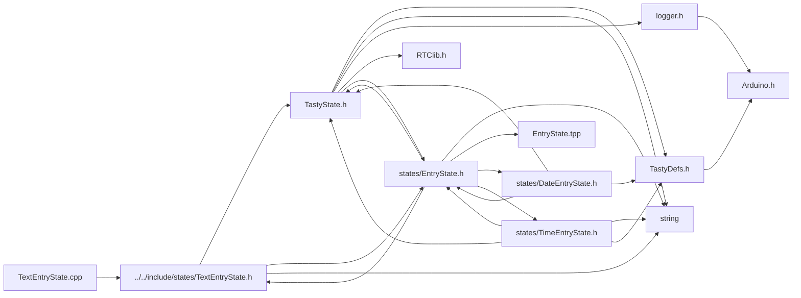

<a id="_text_entry_state_8cpp"></a>
# File TextEntryState.cpp

![][C++]

**Location**: `src/states/TextEntryState.cpp`


## Includes

* [../../include/states/TextEntryState.h](_text_entry_state_8h.md#_text_entry_state_8h)



## Source

```cpp
#include "../../include/states/TextEntryState.h"

TextEntryState::TextEntryState(String name, uint8_t length, String data_, handler_t saveFn, TastyState* returnState, bool caseSensitive) :
    EntryState::EntryState(name, length, data_, saveFn, returnState, this),
    caseSensitive{ caseSensitive }
{
    originalData = String(data_);
}


// handler_t EntryState<DataType, D>::drawFn;

// template <typename DataType, typename D>
void TextEntryState::setDrawFn(handler_t dFn) {
    TextEntryState::drawFn = dFn;
}

void TextEntryState::increase() {
    // TextEntryState* entry = (TextEntryState*)(entry);

    data[editIndex]++;
    if (data[editIndex] > '9' && data[editIndex] < 'A') {
        data[editIndex] = 'A';
    } else if (data[editIndex] > 'Z' && (caseSensitive && data[editIndex] < 'a')) {
        data[editIndex] = 'a';
    } else if ((!caseSensitive && data[editIndex] > 'Z') || (caseSensitive && data[editIndex] > 'z')) {
        data[editIndex] = '0';
    }
}


void TextEntryState::decrease() {
    // TextEntryState* entry = (TextEntryState*)(entry);
    data[editIndex]--;
    if (data[editIndex] < '0') {
        if (caseSensitive) {
            data[editIndex] = 'z';
        } else {
            data[editIndex] = 'Z';
        }
    } else if (data[editIndex] < 'A' && data[editIndex] > '9') {
        data[editIndex] = '9';
    } else if (data[editIndex] < 'a' && data[editIndex] > 'Z') {
        data[editIndex] = 'Z';
    }
}
void TextEntryState::adjustIndexUp() {

}
void TextEntryState::adjustIndexDown() {

}
```

[public]: https://img.shields.io/badge/-public-brightgreen (public)
[C++]: https://img.shields.io/badge/language-C%2B%2B-blue (C++)
[static]: https://img.shields.io/badge/-static-lightgrey (static)
[private]: https://img.shields.io/badge/-private-red (private)
[Markdown]: https://img.shields.io/badge/language-Markdown-blue (Markdown)