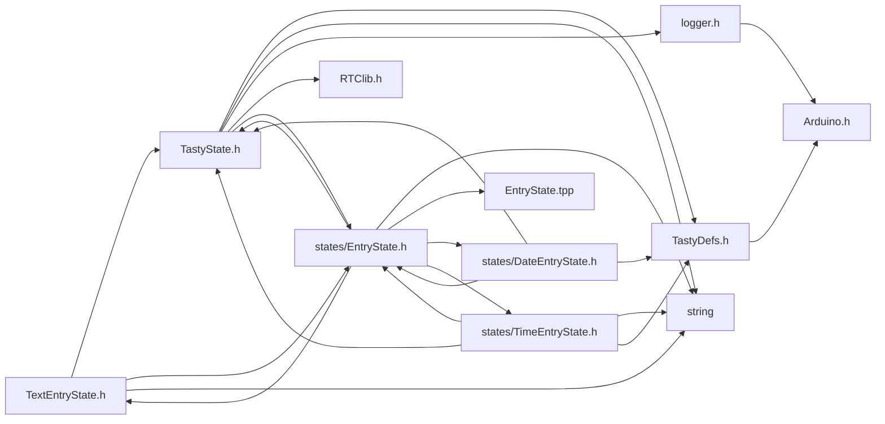
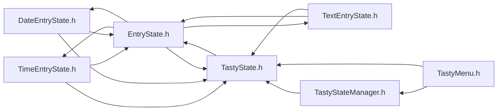

<a id="_text_entry_state_8h"></a>
# File TextEntryState.h

![][C++]

**Location**: `include/states/TextEntryState.h`


## Classes

* [TextEntryState](class_text_entry_state.md#class_text_entry_state)

## Includes

* <TastyState.h>
* [EntryState.h](_entry_state_8h.md#_entry_state_8h)
* <string>



## Included by

* [EntryState.h](_entry_state_8h.md#_entry_state_8h)
* [TextEntryState.cpp](_text_entry_state_8cpp.md#_text_entry_state_8cpp)



## Source

```cpp
#ifndef TASTY_TEXT_ENTRY_STATE_H
#define TASTY_TEXT_ENTRY_STATE_H

#include <TastyState.h>
#include "EntryState.h"
#include <string>

class TextEntryState : public EntryState<String, TextEntryState> {
public:
    bool caseSensitive;
    static void setDrawFn(handler_t dFn);
    TextEntryState(String name, uint8_t length, String data, handler_t saveFn, TastyState* returnState, bool caseSensitive = false);
    void increase();
    void decrease();
    void adjustIndexUp();
    void adjustIndexDown();
};

#endif
```

[public]: https://img.shields.io/badge/-public-brightgreen (public)
[C++]: https://img.shields.io/badge/language-C%2B%2B-blue (C++)
[static]: https://img.shields.io/badge/-static-lightgrey (static)
[private]: https://img.shields.io/badge/-private-red (private)
[Markdown]: https://img.shields.io/badge/language-Markdown-blue (Markdown)