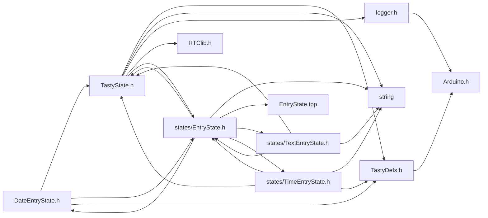
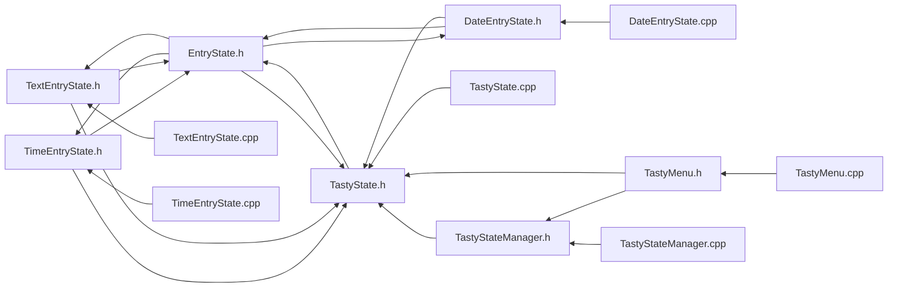

<a id="a00032"></a>
# File DateEntryState.h

![][C++]

**Location**: `include/states/DateEntryState.h`


## Classes

* [DateEntryState](a00080.md#a00080)

## Includes

* <TastyState.h>
* [EntryState.h](a00035.md#a00035)
* <TastyDefs.h>



## Included by

* [DateEntryState.cpp](a00059.md#a00059)
* [EntryState.h](a00035.md#a00035)



## Source

```cpp
#ifndef TASTY_DATE_ENTRY_STATE_H
#define TASTY_DATE_ENTRY_STATE_H

#include <TastyState.h>
#include "EntryState.h"
#include <TastyDefs.h>

class DateEntryState : public EntryState<DateTimeObj, DateEntryState> {
public:
    uint8_t editIndex = 1;
    DateEntryState(String name, DateTimeObj data, handler_t saveFn, TastyState* returnState);
    void increase();
    void decrease();
    void adjustIndexUp();
    void adjustIndexDown();
};


#endif
```

[public]: https://img.shields.io/badge/-public-brightgreen (public)
[C++]: https://img.shields.io/badge/language-C%2B%2B-blue (C++)
[static]: https://img.shields.io/badge/-static-lightgrey (static)
[private]: https://img.shields.io/badge/-private-red (private)