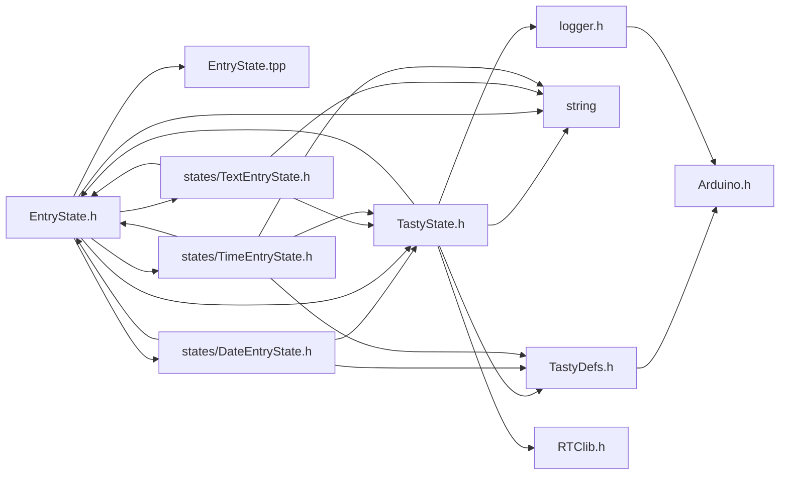
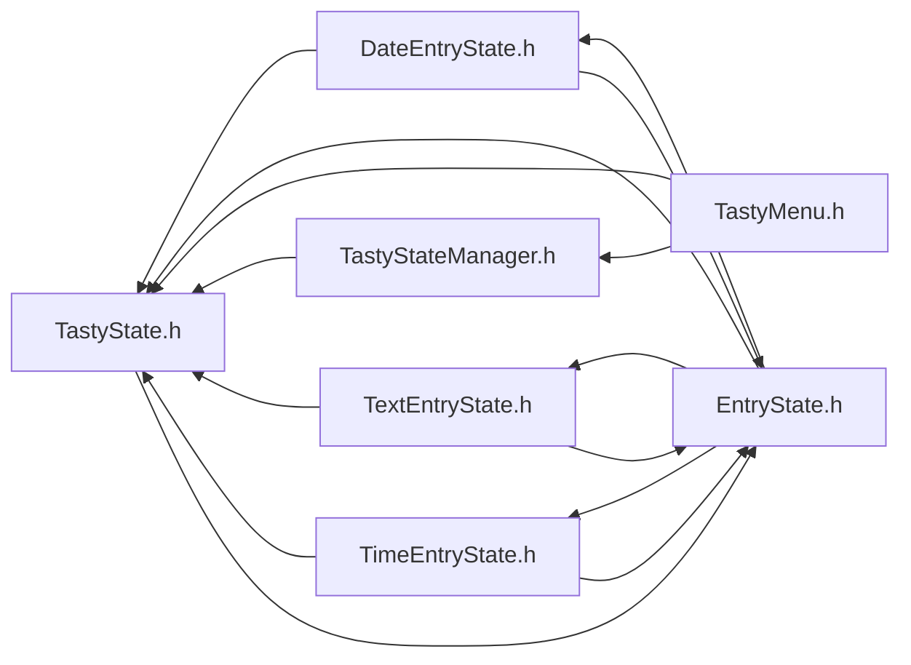

<a id="a00035"></a>
# File EntryState.h

![][C++]

**Location**: `include/states/EntryState.h`


## Classes

* [EntryState](a00084.md#a00084)

## Includes

* <TastyState.h>
* <string>
* EntryState.tpp
* [states/TextEntryState.h](a00038.md#a00038)
* [states/DateEntryState.h](a00032.md#a00032)
* [states/TimeEntryState.h](a00041.md#a00041)



## Included by

* [DateEntryState.h](a00032.md#a00032)
* [TastyState.h](a00050.md#a00050)
* [TextEntryState.h](a00038.md#a00038)
* [TimeEntryState.h](a00041.md#a00041)



## Source

```cpp
#ifndef TASTY_ENTRY_STATE_H
#define TASTY_ENTRY_STATE_H

#include <TastyState.h>
#include <string>

template <typename DataType, typename D>
class EntryState {
public:
    TastyState* state;
    bool inEdit = false;
    uint8_t editIndex = 0;
    DataType originalData;
    DataType data;
    uint8_t length;
    char editVal = '0'; // 48
    handler_t saveFn;

    TastyState* saveState;

    static handler_t drawFn;
    static void setDrawFn(handler_t dFn);

    EntryState(String name, uint8_t length, DataType data, handler_t saveFn, TastyState* returnState, D* ref);
    static bool onClick(TastyState* state, void*);
    static bool onUp(TastyState* state, void*);
    static bool onDown(TastyState* state, void*);
    static bool onRight(TastyState* state, void*);
    static bool onLeft(TastyState* state, void*);

    static bool reset(TastyState* state, void*);
    // static void onSave(TastyState* state, void*);

    // static bool onTick(TastyState* state, void*);

    void increase() {}; // Override
    void decrease() {}; // Override
    void adjustIndexUp(); // Override
    void adjustIndexDown(); // Override

};

#include "EntryState.tpp"
#include "states/TextEntryState.h"
#include "states/DateEntryState.h"
#include "states/TimeEntryState.h"


#endif
```

[public]: https://img.shields.io/badge/-public-brightgreen (public)
[C++]: https://img.shields.io/badge/language-C%2B%2B-blue (C++)
[static]: https://img.shields.io/badge/-static-lightgrey (static)
[private]: https://img.shields.io/badge/-private-red (private)