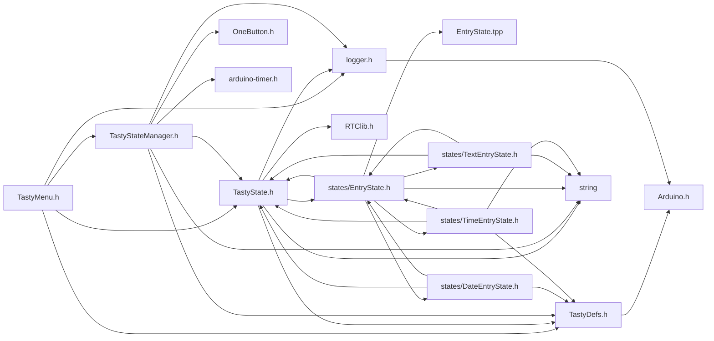
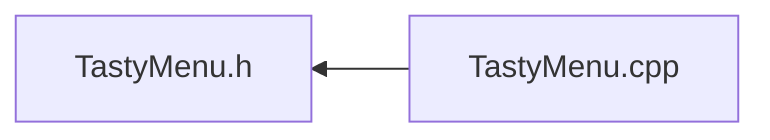

<a id="a00047"></a>
# File TastyMenu.h

![][C++]

**Location**: `include/TastyMenu.h`

[TastyMenu](a00120.md#a00120) header file, manages setting up states for use as a menu.

The [TastyMenu](a00120.md#a00120) class is designed to manage a menu system where each menu can contain multiple states. It allows for the creation of submenus, back navigation, and timeout handling for menu states. This class is particularly useful in applications where a user interface requires a structured menu system.


Example usage: ```cpp
TastyState* stateOne = new TastyState( "State One");
TastyState* stateTwo = new TastyState( "State Two");
TastyMenu myMenu(2, &stateOne, &stateTwo);

// Adding a submenu
TastyMenu subMenu(1, &stateThree);
myMenu.addSubmenu(&stateOne, &subMenu);

// Adding a back menu
TastyMenu backMenu(1, &stateBack);
myMenu.addBackMenu(&stateTwo, &backMenu);
```


**author**\
Brian Kelley


**date**\
2023-12-09

## Classes

* [TastyMenu](a00120.md#a00120)

## Includes

* [TastyDefs.h](a00044.md#a00044)
* [TastyState.h](a00050.md#a00050)
* [TastyStateManager.h](a00053.md#a00053)
* <logger.h>



## Included by

* [TastyMenu.cpp](a00068.md#a00068)



## Source

```cpp

#ifndef TASTY_MENU_H
#define TASTY_MENU_H

#include "TastyDefs.h"
#include "TastyState.h"
#include "TastyStateManager.h"
#include <logger.h>

class TastyMenu {
private:
    TastyStateManager& tastySM = TastyStateManager::getInstance();

    void initializeState(TastyState* state, uint8_t index);

    void calculateIndices(TastyState* initialState);
    void addEvents(TastyState* state);

public:
    TastyState* head = nullptr; 
    TastyMenu* backMenu = nullptr; 
    uint8_t length = 0; 

    static uint16_t defaultMenuTimeout; 
    static TastyState* defaultTimeoutState; 
    static handler_t drawFn; 
    static void setDrawFn(handler_t dFn); 

    TastyMenu(uint8_t len, ...);

    

    static bool activateSubMenu(TastyState* state, void*); 
    static bool activateBackMenu(TastyState* state, void*); 

    void addTimeoutToState(TastyState* state); 

    void addNextMenuState(TastyState* existingState, TastyState* newState); 
    void addPreviousMenuState(TastyState* existingState, TastyState* newState); 

    void addSubmenu(TastyState* existingState, TastyMenu* menu); 
    void addBackMenu(TastyState* existingState, TastyMenu* menu); 
};

#endif
```

[public]: https://img.shields.io/badge/-public-brightgreen (public)
[C++]: https://img.shields.io/badge/language-C%2B%2B-blue (C++)
[static]: https://img.shields.io/badge/-static-lightgrey (static)
[private]: https://img.shields.io/badge/-private-red (private)
[Markdown]: https://img.shields.io/badge/language-Markdown-blue (Markdown)