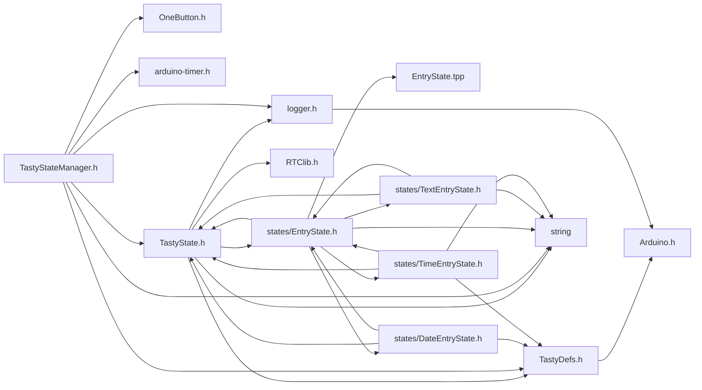

<a id="a00053"></a>
# File TastyStateManager.h

![][C++]

**Location**: `include/TastyStateManager.h`


## Classes

* [Timeout](a00128.md#a00128)
* [TastyStateManager](a00132.md#a00132)

## Includes

* OneButton.h
* <arduino-timer.h>
* [TastyDefs.h](a00044.md#a00044)
* <string>
* [TastyState.h](a00050.md#a00050)
* <logger.h>



## Included by

* [TastyMenu.h](a00047.md#a00047)
* [TastyStateManager.cpp](a00074.md#a00074)


## Source

```cpp
#ifndef TASTY_STATE_MANAGER_H
#define TASTY_STATE_MANAGER_H

#include "OneButton.h"
#include <arduino-timer.h>
#include "TastyDefs.h"
#include <string>
#include "TastyState.h"
#include <logger.h>

class TastyMenu;

struct Timeout {
    TastyState* state;
    uint32_t time;
};


class TastyStateManager {
private:
    int8_t LED_R = NOT_A_PIN;
    int8_t LED_G = NOT_A_PIN;
    int8_t LED_B = NOT_A_PIN;
    int8_t LED = NOT_A_PIN;

    TastyStateManager();

    static bool stateTimeoutHandler(void*);
    static bool toggleLed(void*);
    static RGBLed EMPTY_RGB_LED;

    void checkTimeout();
    void applyLed();

    TastyState* getTimeoutState();
    int32_t getTimeout();

    static Timer<> timer;
    static Timer<>::Task ledTask;
    static Timer<>::Task timeoutTask;
    static Timeout timeout;


public:

    // Statics for management
    static void onClick();

    static void onDoubleClick();

    static void onMultiClick();

    static void onLongPress();

    static void onUpPress();

    static void onDownPress();

    static void onRightPress();

    static void onLeftPress();

    TastyState* activeState = nullptr;

    TastyState* lastState = nullptr;

    TastyState* defaultState = nullptr;

    TastyState* defaultTimeoutState = nullptr;

    BlinkState ledState;

    static TastyStateManager& getInstance();

    void setDefaultState(TastyState* state);

    void setTimeoutState(TastyState* state);

    void setupLed(int8_t ledPin);

    void setupLed(int8_t ledR, int8_t ledG, int8_t ledB);

    void setupDefaultStates(TastyState* defaultS = nullptr, TastyState* timeoutS = nullptr);

    void begin(TastyState* defaultState = nullptr, TastyState* timeoutState = nullptr, int8_t ledPin = NOT_A_PIN);

    void begin(TastyState* defaultState = nullptr, TastyState* timeoutState = nullptr, RGBLed ledPin = TastyStateManager::EMPTY_RGB_LED);

    void begin(TastyState* defaultState = nullptr, TastyState* timeoutState = nullptr);

    void tick();

    void setState(TastyState* nextState = timeout.state);

    void setTimeoutTask();
};

#endif
```

[public]: https://img.shields.io/badge/-public-brightgreen (public)
[C++]: https://img.shields.io/badge/language-C%2B%2B-blue (C++)
[static]: https://img.shields.io/badge/-static-lightgrey (static)
[private]: https://img.shields.io/badge/-private-red (private)
[Markdown]: https://img.shields.io/badge/language-Markdown-blue (Markdown)