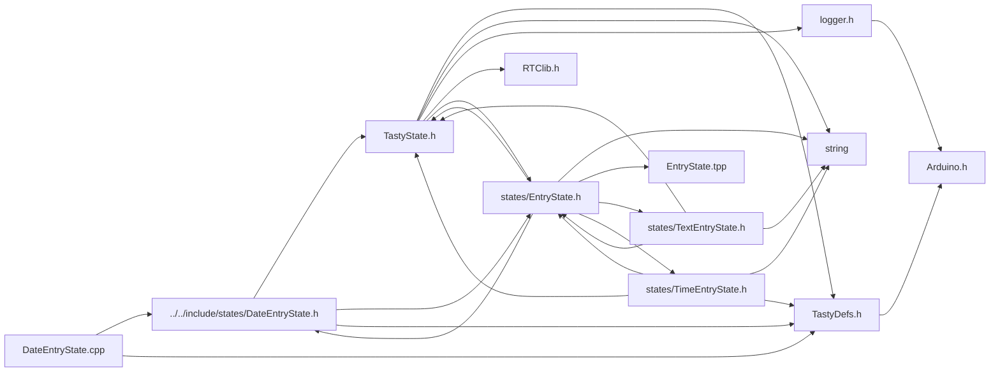

<a id="a00059"></a>
# File DateEntryState.cpp

![][C++]

**Location**: `src/states/DateEntryState.cpp`


## Includes

* [../../include/states/DateEntryState.h](a00032.md#a00032)
* <TastyDefs.h>



## Source

```cpp
#include "../../include/states/DateEntryState.h"

#include <TastyDefs.h>

DateEntryState::DateEntryState(String name, DateTimeObj data, handler_t saveFn, TastyState* returnState) : EntryState::EntryState(name, 10, data, saveFn, returnState, this) {};
void DateEntryState::adjustIndexUp() {
    if (editIndex >= length) {
        editIndex = 1;
    }
    switch (editIndex) {
    case 8:
    case 7:
    case 6:
    case 5:
        editIndex = length - 1;
        break;
    case 3:
    case 2:
        editIndex = 4;
        break;
    case 0:
        editIndex = 1;
        break;
    }
}
void DateEntryState::adjustIndexDown() {
    if (editIndex < 0) {
        editIndex = length - 1;
    }
    switch (editIndex) {
    case 8:
    case 7:
    case 6:
    case 5:
        editIndex = 4;
        break;
    case 3:
    case 2:
        editIndex = 1;
        break;
    case 0:
        editIndex = length - 1;
        break;
    }
}
void DateEntryState::increase() {
    switch (editIndex) {
    case 0:
    case 1:
        data.month++;
        if (data.month > 12) {
            data.month = 1;
        }
        break;
    case 3:
    case 4:
        data.day++;
        if (data.day > 31) {
            data.day = 1;
        }
        break;
    default:
        data.year++;
        break;

    }

}
void DateEntryState::decrease() {
    switch (editIndex) {
    case 0:
    case 1:
        data.month--;
        if (data.month <= 0) {
            data.month = 12;
        }
        break;
    case 3:
    case 4:
        data.day--;
        if (data.day <= 0) {
            data.day = 31;
        }
        break;
    default:
        data.year--;
        break;
    }
}
```

[public]: https://img.shields.io/badge/-public-brightgreen (public)
[C++]: https://img.shields.io/badge/language-C%2B%2B-blue (C++)
[static]: https://img.shields.io/badge/-static-lightgrey (static)
[private]: https://img.shields.io/badge/-private-red (private)
[Markdown]: https://img.shields.io/badge/language-Markdown-blue (Markdown)