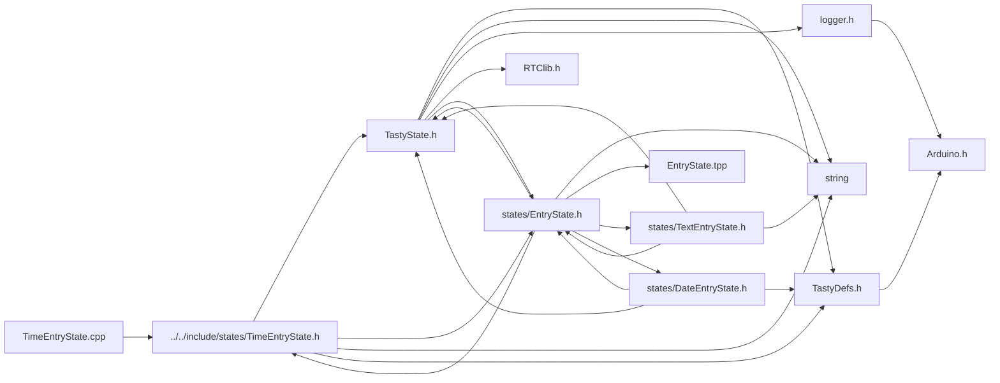

<a id="a00065"></a>
# File TimeEntryState.cpp

![][C++]

**Location**: `src/states/TimeEntryState.cpp`


## Includes

* [../../include/states/TimeEntryState.h](a00041.md#a00041)



## Source

```cpp
#include "../../include/states/TimeEntryState.h"

TimeEntryState::TimeEntryState(String name, DateTimeObj data, handler_t saveFn, TastyState* returnState) : EntryState::EntryState(name, 5, data, saveFn, returnState, this) {};
void TimeEntryState::adjustIndexUp() {
    if (editIndex >= length) {
        editIndex = 1;
    }
    switch (editIndex) {
    case 3:
    case 2:
        editIndex = 4;
        break;
    case 0:
        editIndex = 1;
        break;
    }
}
void TimeEntryState::adjustIndexDown() {
    if (editIndex < 0) {
        editIndex = length - 1;
    }
    switch (editIndex) {
    case 3:
    case 2:
        editIndex = 1;
        break;
    case 0:
        editIndex = length - 1;
        break;
    }
}
void TimeEntryState::increase() {
    switch (editIndex) {
    case 0:
    case 1:
        data.hour++;
        if (data.hour > 23) {
            data.hour = 0;
        }
        break;
    case 3:
    case 4:
        data.minute++;
        if (data.minute >= 60) {
            data.minute = 0;
        }
        break;
    }

}
void TimeEntryState::decrease() {
    switch (editIndex) {
    case 0:
    case 1:
        if (data.hour <= 0) {
            data.hour = 23;
        } else {
            data.hour--;
        }
        break;
    case 3:
    case 4:
        if (data.minute <= 0) {
            data.minute = 59;
        } else {
            data.minute--;
        }
        break;
    }
}
```

[public]: https://img.shields.io/badge/-public-brightgreen (public)
[C++]: https://img.shields.io/badge/language-C%2B%2B-blue (C++)
[static]: https://img.shields.io/badge/-static-lightgrey (static)
[private]: https://img.shields.io/badge/-private-red (private)
[Markdown]: https://img.shields.io/badge/language-Markdown-blue (Markdown)