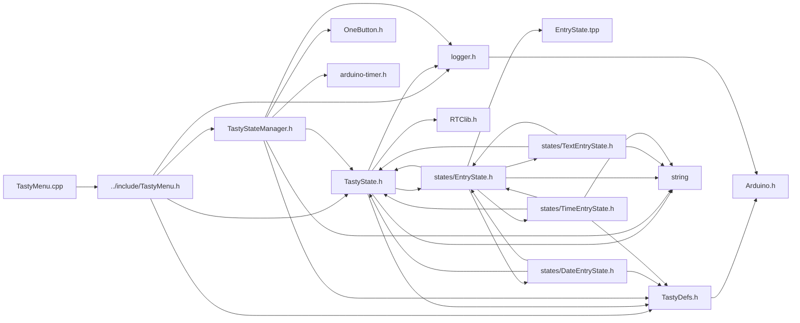

<a id="a00068"></a>
# File TastyMenu.cpp

![][C++]

**Location**: `src/TastyMenu.cpp`


## Includes

* [../include/TastyMenu.h](a00047.md#a00047)



## Source

```cpp
#include "../include/TastyMenu.h"
// #include "../include/TastyState.h"

class TastyMenu;
uint16_t TastyMenu::defaultMenuTimeout;
TastyState* TastyMenu::defaultTimeoutState = nullptr;

TastyMenu::TastyMenu(uint8_t len, ...) {
    length = len;

    va_list items;
    va_start(items, len);
    TastyState* prevItem = va_arg(items, TastyState*);
    TastyState* currItem;

    initializeState(prevItem, 0);
    head = prevItem;

    Serial.println(" ---- New Submenu ---- ");
    Serial.printf("Adding State: %s", prevItem->name);
    Serial.println();

    for (uint8_t i = 1; i < len; ++i) {
        currItem = va_arg(items, TastyState*);
        currItem->onUpClickState = prevItem;
        initializeState(currItem, i);

        prevItem->onDownClickState = currItem;
        Serial.printf("Adding State: %s", currItem->name);
        Serial.println();

        prevItem = currItem;
        currItem = nullptr;
    }

    // activeState = head;
    Serial.printf("Head State: %s", head->name);
    Serial.println();
}

void TastyMenu::initializeState(TastyState* state, uint8_t index) {
    state->onEvent(TastyEventType::TICK, TastyMenu::drawFn);
    state->onEvent(TastyEventType::LONG_CLICK, TastyMenu::activateBackMenu);
    state->menu = this;
    addTimeoutToState(state);
}

void TastyMenu::addTimeoutToState(TastyState* state) {
    if (state->timeout == 0) {
        state->setTimeout(TastyMenu::defaultMenuTimeout);
    }
    if (state->onTimeoutState == nullptr && TastyMenu::defaultTimeoutState != nullptr) {
        state->onTimeoutState = TastyMenu::defaultTimeoutState;
    }
}

handler_t TastyMenu::drawFn;
void TastyMenu::setDrawFn(handler_t dFn) {
    TastyMenu::drawFn = dFn;
}

void TastyMenu::addNextMenuState(TastyState* existingState, TastyState* newState) {
    if (existingState == nullptr || newState == nullptr) {
        logerr("Error: Attempt to add a null state.");
        return; // Handle null pointers gracefully
    }
    if (existingState->onDownClickState == nullptr) {
        existingState->onDownClickState = newState;
    } else {
        newState->onDownClickState = existingState->onDownClickState;
        existingState->onDownClickState->onUpClickState = newState;
        existingState->onUpClickState = newState;
    }
    newState->onUpClickState = existingState;
    newState->menu = this; // set the menu for the new state
    calculateIndices(existingState);
}

void TastyMenu::addPreviousMenuState(TastyState* existingState, TastyState* newState) {
    if (existingState == nullptr || newState == nullptr) {
        logerr("Error: Attempting to add a null state.");
        return; // Handle null pointers gracefully
    }
    if (existingState->onUpClickState != nullptr) {
        newState->onUpClickState = existingState->onUpClickState; // set the up click state of b to the up click state of a
        existingState->onUpClickState->onDownClickState = newState; // set the previous state to the new state
    }
    existingState->onUpClickState = newState; // set the previous state
    newState->onDownClickState = existingState; // set the previous state for the new state
    newState->menu = this; // set the menu for the new state
    calculateIndices(existingState);
}

void TastyMenu::calculateIndices(TastyState* curr) {
    // Move to the top of the stack
    while (curr != nullptr) {
        curr = curr->onUpClickState;
    }

    uint8_t i;
    for (i = 0; curr->onDownClickState != nullptr; curr = curr->onDownClickState) {
        curr->index = i;
    }
    length = i;
}

void TastyMenu::addSubmenu(TastyState* existingState, TastyMenu* menu) {
    if (existingState == nullptr) {
        logerr("Error: Attempting to add a menu to a null state.");
        return; // Handle null pointers gracefully
    }
    if (menu == nullptr || menu->head == nullptr) {
        logerr("Error: Attempting to add an empty menu to a state.");
        return;
    }

    logdbg("Adding Menu to state");
    existingState->print();
    menu->backMenu = this;
    existingState->addEvents(menu->head);

    existingState->onRightClickState = menu->head;
    TastyState* s = menu->head;
    do {
        loginfo_f( "Setting up back menu for state %s -> %s", s->name, existingState->name );
        addBackMenu(s, this);
        s->onLeftClickState = existingState;

    } while (s = s->onDownClickState);
}

void TastyMenu::addBackMenu(TastyState* existingState, TastyMenu* menu) {
    existingState->backMenu = this;
}

bool TastyMenu::activateSubMenu(TastyState* state, void*) {
    if (state != nullptr && state->forwardMenu != nullptr) {
        TastyStateManager::getInstance().setState(state->forwardMenu->head);
        return true;
    }
    return false;
}

bool TastyMenu::activateBackMenu(TastyState* state, void*) {
    if (state->menu->backMenu != nullptr) {
        TastyStateManager::getInstance().setState(state->onLeftClickState);
        return true;
    }
    return false;
}

// bool TastyMenu::eventPassthrough( TastyEventType e, )
```

[public]: https://img.shields.io/badge/-public-brightgreen (public)
[C++]: https://img.shields.io/badge/language-C%2B%2B-blue (C++)
[static]: https://img.shields.io/badge/-static-lightgrey (static)
[private]: https://img.shields.io/badge/-private-red (private)
[Markdown]: https://img.shields.io/badge/language-Markdown-blue (Markdown)