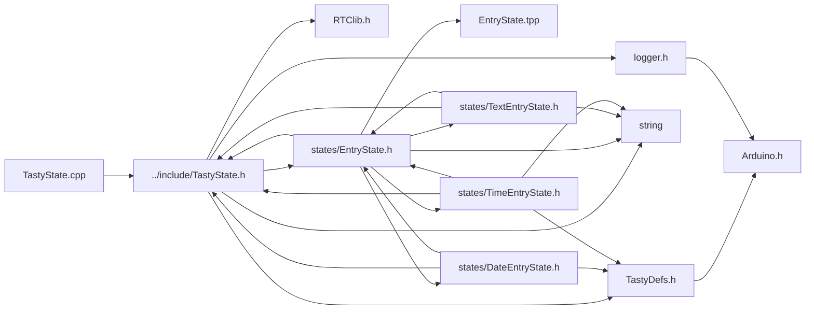

<a id="a00071"></a>
# File TastyState.cpp

![][C++]

**Location**: `src/TastyState.cpp`


## Includes

* [../include/TastyState.h](a00050.md#a00050)



## Variables

<a id="a00071_1adad7e71ce97e29d1a8197251ad299568"></a>
### Variable PROGMEM

![][public]

**Definition**: `src/TastyState.cpp` (line 6)

```cpp
const unsigned char icon_empty [] PROGMEM = {
    0x00, 0x00, 0x00, 0x00, 0x00, 0x00, 0x00, 0x00, 0x00, 0x00, 0x00, 0x00, 0x00, 0x00, 0x00, 0x00,
    0x00, 0x00, 0x00, 0x00, 0x00, 0x00, 0x00, 0x00, 0x00, 0x00, 0x00, 0x00, 0x00, 0x00, 0x00, 0x00
}
```

An array representing an empty icon stored in program memory.


**Type**: const unsigned char [icon\_empty](a00044.md#a00044_1a1365b7db892a3f72af1ad360efa9877c)[]

<a id="a00071_1a78294f7f940fde09dd0a4580241669a5"></a>
### Variable blinkSpeedValues

![][public]

**Definition**: `src/TastyState.cpp` (line 14)

```cpp
int16_t blinkSpeedValues[6][6] = { 0, 1000, 500, 250, 50, 1 }
```

Blink speed values in milliseconds.


**Type**: int16_t

<a id="a00071_1a7ba53dff5b14c361de74e970a66df810"></a>
### Variable LED\_RED

![][public]

**Definition**: `src/TastyState.cpp` (line 18)

```cpp
LedColor LED_RED = { 255, 0, 0 }
```


**Type**: [LedColor](a00100.md#a00100)

<a id="a00071_1aea6819032486feea16e83183ab9fdd38"></a>
### Variable LED\_ORANGE

![][public]

**Definition**: `src/TastyState.cpp` (line 19)

```cpp
LedColor LED_ORANGE = { 255, 175, 0 }
```


**Type**: [LedColor](a00100.md#a00100)

<a id="a00071_1a5bfd2a5a80ca39fabb52e1d410d8f980"></a>
### Variable LED\_YELLOW

![][public]

**Definition**: `src/TastyState.cpp` (line 20)

```cpp
LedColor LED_YELLOW = { 255, 255, 0 }
```


**Type**: [LedColor](a00100.md#a00100)

<a id="a00071_1a110aafbb151eb4c36c87dbda3c3f7eaf"></a>
### Variable LED\_GREEN

![][public]

**Definition**: `src/TastyState.cpp` (line 21)

```cpp
LedColor LED_GREEN = { 0, 255, 0 }
```


**Type**: [LedColor](a00100.md#a00100)

<a id="a00071_1a86fddb6d4b61f518c7f603280ecf9598"></a>
### Variable LED\_TEAL

![][public]

**Definition**: `src/TastyState.cpp` (line 22)

```cpp
LedColor LED_TEAL = { 0, 255, 255 }
```


**Type**: [LedColor](a00100.md#a00100)

<a id="a00071_1a85d3081f2292ade27dbf73eba4414daa"></a>
### Variable LED\_BLUE

![][public]

**Definition**: `src/TastyState.cpp` (line 23)

```cpp
LedColor LED_BLUE = { 0, 0, 255 }
```


**Type**: [LedColor](a00100.md#a00100)

<a id="a00071_1a0457d0cd29fa55a9bac9e7c367e7bc93"></a>
### Variable LED\_PURPLE

![][public]

**Definition**: `src/TastyState.cpp` (line 24)

```cpp
LedColor LED_PURPLE = { 255, 0, 255 }
```


**Type**: [LedColor](a00100.md#a00100)

<a id="a00071_1a6b3a268faadf21e252cea97c809e32e9"></a>
### Variable LED\_WHITE

![][public]

**Definition**: `src/TastyState.cpp` (line 25)

```cpp
LedColor LED_WHITE = { 255, 255, 255 }
```


**Type**: [LedColor](a00100.md#a00100)

<a id="a00071_1a70e1bdabd42ba28937c01ccddde0a157"></a>
### Variable EMPTY\_STATE

![][public]

**Definition**: `src/TastyState.cpp` (line 131)

```cpp
TastyState* EMPTY_STATE = new [TastyState](a00124.md#a00124)("EMPTY STATE", -1, { 0, 0, 0 }, [LED\_OFF](a00044.md#a00044_1aab6b50cd48c7a2b548e5f596b3873edbafc0ca8cc6cbe215fd3f1ae6d40255b40))
```

A default empty state instance of [TastyState](a00124.md#a00124).


**Type**: [TastyState](a00124.md#a00124) *

## Source

```cpp
#include "../include/TastyState.h"

const unsigned char icon_empty[] PROGMEM = {
    0x00, 0x00, 0x00, 0x00, 0x00, 0x00, 0x00, 0x00, 0x00, 0x00, 0x00, 0x00, 0x00, 0x00, 0x00, 0x00,
    0x00, 0x00, 0x00, 0x00, 0x00, 0x00, 0x00, 0x00, 0x00, 0x00, 0x00, 0x00, 0x00, 0x00, 0x00, 0x00
};

int16_t blinkSpeedValues[6] = { 0, 1000, 500, 250, 50, 1 };


// Define various LED colors
LedColor LED_RED = { 255, 0, 0 };
LedColor LED_ORANGE = { 255, 175, 0 };
LedColor LED_YELLOW = { 255, 255, 0 };
LedColor LED_GREEN = { 0, 255, 0 };
LedColor LED_TEAL = { 0, 255, 255 };
LedColor LED_BLUE = { 0, 0, 255 };
LedColor LED_PURPLE = { 255, 0, 255 };
LedColor LED_WHITE = { 255, 255, 255 };

int32_t TastyState::defaultTimeout = 10000;

void TastyState::setLEDColor(int8_t r, int8_t g, int8_t b) {
    ledColor.r = r;
    ledColor.g = g;
    ledColor.b = b;
}

void TastyState::setLEDColor(LedColor color) {
    ledColor = color;
}

void TastyState::setBlinkSpeed(BlinkSpeed ledSpeed) {
    ledSpeed = ledSpeed;
}

void TastyState::addEvents(TastyState* clickState, TastyState* doubleClickState, TastyState* multiClickState, TastyState* longPressState) {
    onClickState = clickState;
    onDoubleClickState = doubleClickState;
    onMultiClickState = multiClickState;
    onLongPressState = longPressState;
}

void TastyState::onEvent(TastyEventType t, handler_t fn, void* param) {
    events[(uint8_t)t].callback = fn;
    events[(uint8_t)t].param = param;
}

bool TastyState::handleEvent(TastyEventType type) {
    eventHandler eh = events[(uint8_t)type];

    if (type != TastyEventType::TICK) {
        Serial.print("Event!: ");
        Serial.println((uint8_t)type);
    }

    if (eh.callback != nullptr) {
        return eh.callback(this, eh.param);
    } else
        return true; // continue
}

void TastyState::print() {
    logdbg(F(" -- STATE -- "));
    logdbg_f("    name: %s", name.c_str());
    logdbg_f("    timeout: %i", timeout);
    LOG_STATE("onClickState", onClickState);
    LOG_STATE("onDoubleClickState", onDoubleClickState);
    LOG_STATE("onLongPressState", onLongPressState);
    LOG_STATE("onMultiClickState", onMultiClickState);
    LOG_STATE("onUpClickState", onUpClickState);
    LOG_STATE("onDownClickState", onDownClickState);
    LOG_STATE("onLeftClickState", onLeftClickState);
    LOG_STATE("onRightClickState", onRightClickState);
    LOG_STATE("onTimeoutState", onTimeoutState);
}

TastyState* EMPTY_STATE = new TastyState("EMPTY STATE", -1, { 0, 0, 0 }, LED_OFF);

```

[public]: https://img.shields.io/badge/-public-brightgreen (public)
[C++]: https://img.shields.io/badge/language-C%2B%2B-blue (C++)
[static]: https://img.shields.io/badge/-static-lightgrey (static)
[private]: https://img.shields.io/badge/-private-red (private)
[Markdown]: https://img.shields.io/badge/language-Markdown-blue (Markdown)