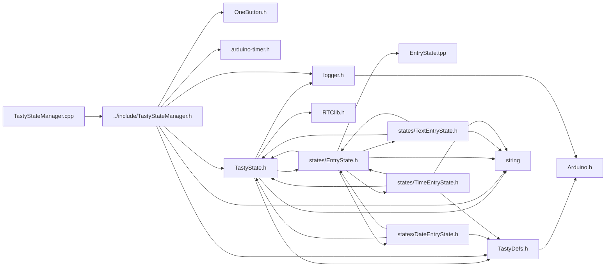

<a id="a00074"></a>
# File TastyStateManager.cpp

![][C++]

**Location**: `src/TastyStateManager.cpp`


## Includes

* [../include/TastyStateManager.h](a00053.md#a00053)



## Source

```cpp
#include "../include/TastyStateManager.h"

Timer<> TastyStateManager::timer = Timer<>();
Timer<>::Task TastyStateManager::timeoutTask = NULL;
Timer<>::Task TastyStateManager::ledTask = NULL;

Timeout TastyStateManager::timeout = { nullptr, 999 };

TastyStateManager::TastyStateManager() {};


bool TastyStateManager::stateTimeoutHandler(void*) {
    if (TastyStateManager::getInstance().activeState->handleEvent(TastyEventType::TIMEOUT)) {
        loginfo("Continue Timeout");
        TastyStateManager::getInstance().setState(TastyStateManager::timeout.state);
    }
    return true;
}

bool TastyStateManager::toggleLed(void*) {
    TastyStateManager::getInstance().ledState.on = !TastyStateManager::getInstance().ledState.on;
    return true;
}

TastyStateManager& TastyStateManager::getInstance() {
    static TastyStateManager instance;
    return instance;
}

void TastyStateManager::begin(TastyState* defaultS, TastyState* timeoutS, int8_t ledPin) {
    loginfo(F("[ State Manager ] Begin 1"));
    logdbg(defaultS->name + " -> " + timeoutS->name);

    if (ledPin != NOT_A_PIN) {
        setupLed(ledPin);
    }
    setupDefaultStates(defaultS, timeoutS);
}

void TastyStateManager::begin(TastyState* defaultS, TastyState* timeoutS, RGBLed ledPin) {
    loginfo(F("[ State Manager ] Begin 2"));
    if (ledPin.r != NOT_A_PIN && ledPin.g != NOT_A_PIN && ledPin.b != NOT_A_PIN) {
        setupLed(ledPin.r, ledPin.g, ledPin.b);
    }
    setupDefaultStates(defaultS, timeoutS);
}

void TastyStateManager::begin(TastyState* defaultS, TastyState* timeoutS) {
    loginfo(F("[ State Manager ] Begin 3"));
    setupDefaultStates(defaultS, timeoutS);
}

void TastyStateManager::setupDefaultStates(TastyState* defaultS, TastyState* timeoutS) {
    loginfo(F("--- setupDefaultStates ---"));
    TastyStateManager::timer.tick();
    if (timeoutS != nullptr) {
        defaultTimeoutState = timeoutS;
        loginfo_f("Timeout State: %s", defaultTimeoutState->name);
    }

    if (defaultS != nullptr) {
        defaultState = defaultS;
        loginfo_f("Default State: %s", defaultState->name);
        delay(250);
        setState(defaultState);
    }
}

void TastyStateManager::setDefaultState(TastyState* state) {
    loginfo(F("[ State Manager ] Set Default State "));
    logdbg_f("%s -> %s", state->name, state->nextState->name);
    defaultState = state;
}

void TastyStateManager::setTimeoutState(TastyState* state) {
    loginfo(F("[ State Manager ] Set Timeout State "));
    logdbg_f("%s -> %s", state->name, state->nextState->name);
    defaultTimeoutState = state;
}

void TastyStateManager::setupLed(int8_t ledPin) {
    LED = ledPin;
    pinMode(LED, OUTPUT);
}

void TastyStateManager::setupLed(int8_t ledR, int8_t ledG, int8_t ledB) {
    LED_R = ledR;
    LED_G = ledG;
    LED_B = ledB;

    pinMode(LED_R, OUTPUT);
    pinMode(LED_G, OUTPUT);
    pinMode(LED_B, OUTPUT);
}

void TastyStateManager::tick() {
    TastyStateManager::timer.tick();
    applyLed();
    activeState->handleEvent(TastyEventType::TICK);
}

void TastyStateManager::setState(TastyState* nextState) {
    logdbg(F("--- Setting State ---"));
    logdbg_f("Active State: %s, Next State: %s", activeState != nullptr ? activeState->name : " --- ", nextState != nullptr ? nextState->name : " --- ");

    if (TastyStateManager::timeoutTask != NULL) {
        TastyStateManager::timer.cancel(TastyStateManager::timeoutTask);
    }
    if (TastyStateManager::ledTask != NULL) {
        TastyStateManager::timer.cancel(TastyStateManager::ledTask);
    }

    lastState = activeState;
    activeState = nextState;

    if (lastState != nullptr) {
        logdbg("lastState::LEAVE");
        lastState->handleEvent(TastyEventType::LEAVE);
    }
    if (activeState != nullptr) {
        logdbg("activeState::ENTER");
        activeState->handleEvent(TastyEventType::ENTER);
    }

    logdbg_f("New Active State: %s", activeState->name);

    ledState.color = nextState->ledColor;
    ledState.speed = nextState->ledSpeed;

    TastyStateManager::timeout.state = getTimeoutState();
    TastyStateManager::timeout.time = getTimeout();
    TastyStateManager::timer.tick();
    setTimeoutTask();

    if (blinkSpeedValues[activeState->ledSpeed]) {
        TastyStateManager::ledTask = TastyStateManager::timer.every(blinkSpeedValues[activeState->ledSpeed], TastyStateManager::toggleLed);
    } else {
        ledState.on = false;
    }
    logdbg(F("--- Set State Complete ---"));
}

void TastyStateManager::setTimeoutTask() {
    logdbg_f("Setting Timeout for %s -> %s in %i", activeState->name, TastyStateManager::timeout.state->name, TastyStateManager::timeout.time);
    if (TastyStateManager::timeoutTask != NULL) {
        TastyStateManager::timer.cancel(TastyStateManager::timeoutTask);
    }
    TastyStateManager::timer.tick();
    TastyStateManager::timeoutTask = TastyStateManager::timer.in(TastyStateManager::timeout.time, TastyStateManager::stateTimeoutHandler);
}

void TastyStateManager::applyLed() {
    // loginfo_f("Led Status %i", ledState.on);
    if (!ledState.on) {
        if (LED_R != NOT_A_PIN && LED_G != NOT_A_PIN && LED_B != NOT_A_PIN) {
            analogWrite(LED_R, LOW);
            analogWrite(LED_G, LOW);
            analogWrite(LED_B, LOW);
        }
        if (LED != NOT_A_PIN) {
            analogWrite(LED, LOW);
        }
        return;
    } else {
        if (ledState.on) {
            if (LED_R != NOT_A_PIN && LED_G != NOT_A_PIN && LED_B != NOT_A_PIN) {
                analogWrite(LED_R, ledState.color.r);
                analogWrite(LED_G, ledState.color.g);
                analogWrite(LED_B, ledState.color.b);
            }
            if (LED != NOT_A_PIN) {
                analogWrite(LED, 255);
            }
        }
    }
}

TastyState* TastyStateManager::getTimeoutState() {
    loginfo(F("--- Get Timeout State ---"));
    loginfo_f("    Current Active: %s ", activeState->name);

    if (activeState != nullptr && activeState->onTimeoutState != nullptr) {
        loginfo_f("    Active State Timeout State ---> %s", activeState->onTimeoutState->name);
        return activeState->onTimeoutState;
    } else if (defaultTimeoutState != nullptr) {
        loginfo_f("    Default State Timeout State ---> %s", defaultTimeoutState->name);
        isActive = false;
        return defaultTimeoutState;
    }
    return defaultState;
}

int32_t TastyStateManager::getTimeout() {
    loginfo(F("--- Get Timeout Time ---"));
    loginfo_f("    Current Active: %s ", activeState->name);

    if (activeState != nullptr) {
        loginfo_f("    Active State Timeout Time ---> %i", activeState->timeout);
        return activeState->timeout;
    }
    return -1;
}

void TastyStateManager::onClick() {
    TastyStateManager::getInstance().setTimeoutTask();
    if (TastyStateManager::getInstance().activeState->handleEvent(TastyEventType::CLICK) && TastyStateManager::getInstance().activeState->onClickState != nullptr) {
        TastyStateManager::getInstance().setState(TastyStateManager::getInstance().activeState->onClickState);
    }
}

void TastyStateManager::onDoubleClick() {
    TastyStateManager::getInstance().setTimeoutTask();
    if (TastyStateManager::getInstance().activeState->handleEvent(TastyEventType::DOUBLE_CLICK) && TastyStateManager::getInstance().activeState->onDoubleClickState != nullptr) {
        TastyStateManager::getInstance().setState(TastyStateManager::getInstance().activeState->onDoubleClickState);
    }
}

void TastyStateManager::onMultiClick() {
    TastyStateManager::getInstance().setTimeoutTask();
    if (TastyStateManager::getInstance().activeState->handleEvent(TastyEventType::MULTI_CLICK) && TastyStateManager::getInstance().activeState->onMultiClickState != nullptr) {
        TastyStateManager::getInstance().setState(TastyStateManager::getInstance().activeState->onMultiClickState);
    }
}

void TastyStateManager::onLongPress() {
    TastyStateManager::getInstance().setTimeoutTask();
    if (TastyStateManager::getInstance().activeState->handleEvent(TastyEventType::LONG_CLICK) && TastyStateManager::getInstance().activeState->onLongPressState != nullptr) {
        TastyStateManager::getInstance().setState(TastyStateManager::getInstance().activeState->onLongPressState);
    }
}

void TastyStateManager::onUpPress() {
    TastyStateManager::getInstance().setTimeoutTask();
    if (TastyStateManager::getInstance().activeState->handleEvent(TastyEventType::UP) && TastyStateManager::getInstance().activeState->onUpClickState != nullptr) {
        TastyStateManager::getInstance().setState(TastyStateManager::getInstance().activeState->onUpClickState);
    }
}

void TastyStateManager::onDownPress() {
    TastyStateManager::getInstance().setTimeoutTask();
    if (TastyStateManager::getInstance().activeState->handleEvent(TastyEventType::DOWN) && TastyStateManager::getInstance().activeState->onDownClickState != nullptr) {
        TastyStateManager::getInstance().setState(TastyStateManager::getInstance().activeState->onDownClickState);
    }
}

void TastyStateManager::onRightPress() {
    TastyStateManager::getInstance().setTimeoutTask();
    if (TastyStateManager::getInstance().activeState->handleEvent(TastyEventType::RIGHT) && TastyStateManager::getInstance().activeState->onRightClickState != nullptr) {
        TastyStateManager::getInstance().setState(TastyStateManager::getInstance().activeState->onRightClickState);
    }
}

void TastyStateManager::onLeftPress() {
    TastyStateManager::getInstance().setTimeoutTask();
    if (TastyStateManager::getInstance().activeState->handleEvent(TastyEventType::LEFT) && TastyStateManager::getInstance().activeState->onLeftClickState != nullptr) {
        TastyStateManager::getInstance().setState(TastyStateManager::getInstance().activeState->onLeftClickState);
    }
}
```

[public]: https://img.shields.io/badge/-public-brightgreen (public)
[C++]: https://img.shields.io/badge/language-C%2B%2B-blue (C++)
[static]: https://img.shields.io/badge/-static-lightgrey (static)
[private]: https://img.shields.io/badge/-private-red (private)
[Markdown]: https://img.shields.io/badge/language-Markdown-blue (Markdown)