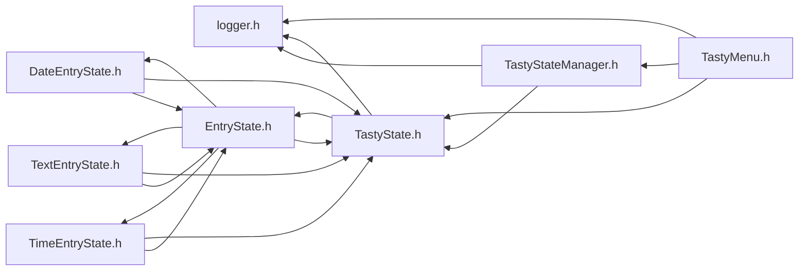

<a id="logger_8h"></a>
# File logger.h

![][C++]

**Location**: `include/logger.h`


## Includes

* Arduino.h


## Included by

* <TastyMenu.h>
* <TastyState.h>
* <TastyStateManager.h>



## Macros

<a id="logger_8h_1a172b50ea44159dd173c7be8d1a3cdd03"></a>
### Macro TB\_DEBUG

![][public]

```cpp
#define TB_DEBUG
```


<a id="logger_8h_1a6178e8454a1d8f79ac0260e7ee4bc57f"></a>
### Macro TB\_LOG\_ERROR

![][public]

```cpp
#define TB_LOG_ERROR
```


<a id="logger_8h_1a0052420918758380f5d84f007f2ff496"></a>
### Macro TB\_LOG\_INFO

![][public]

```cpp
#define TB_LOG_INFO
```


<a id="logger_8h_1a5fccb4fc71e44089a1b1a77fc76c0b68"></a>
### Macro \_\_FILENAME\_\_

![][public]

```cpp
#define __FILENAME__   (strrchr(__FILE__, '/') ? strrchr(__FILE__, '/') + 1 : __FILE__)
```


<a id="logger_8h_1a7b95025357223824f2bc34bc59c0464c"></a>
### Macro logerr

![][public]

```cpp
#define logerr   do {                                                                         \
    Serial.print("[ERR: ");                                                    \
    Serial.print(String(__FILENAME__) + ":" + String(__LINE__) + "]  ");       \
    Serial.println(__VA_ARGS__);                                               \
  } while (0)( ... )
```


<a id="logger_8h_1aa6d7b10b0198b04a0ead3c1d1f72eaa2"></a>
### Macro logerr\_f

![][public]

```cpp
#define logerr_f   do {                                                                         \
    Serial.print("[ERR: ");                                                    \
    Serial.print(String(__FILENAME__) + ":" + String(__LINE__) + "]  ");       \
    Serial.printf(__VA_ARGS__);                                                \
  } while (0)( ... )
```


<a id="logger_8h_1a7c643c9ef78fd7efaabc3cbbc70db1fc"></a>
### Macro logwarn

![][public]

```cpp
#define logwarn   {}( ... )
```


<a id="logger_8h_1a9a5c898edc75de8cf6ea90263dfab4da"></a>
### Macro logwarn\_f

![][public]

```cpp
#define logwarn_f   {}( ... )
```


<a id="logger_8h_1a17937d35f615900844a30b4799acbecf"></a>
### Macro loginfo

![][public]

```cpp
#define loginfo   do {                                                                         \
    Serial.print("[INF: ");                                                    \
    Serial.print(String(__FILENAME__) + ":" + String(__LINE__) + "]  ");                                \
    Serial.println(__VA_ARGS__);                                               \
  } while (0)( ... )
```


<a id="logger_8h_1a8d700f1c1100224ae1d75145b2fb381e"></a>
### Macro loginfo\_f

![][public]

```cpp
#define loginfo_f   do {                                                                         \
    Serial.print("[INF: ");                                                    \
    Serial.print(String(__FILENAME__) + ":" + String(__LINE__) + "]  ");                                \
    Serial.printf(__VA_ARGS__);                                                \
    Serial.println();                                                          \
  } while (0)( ... )
```


<a id="logger_8h_1af6899047d064a464e110f6450cb8e731"></a>
### Macro logdbg

![][public]

```cpp
#define logdbg   {}( ... )
```


<a id="logger_8h_1a56fdc9fe5e2c13af2979a4ab60933805"></a>
### Macro logdbg\_f

![][public]

```cpp
#define logdbg_f   {}( ... )
```


## Source

```cpp
// Logger from Cluster Duck Protocol
#ifndef TASTY_LOGGER_H
#define TASTY_LOGGER_H

#ifndef TB_NO_LOG
#include "Arduino.h"
#define TB_DEBUG
#endif

#ifdef TB_DEBUG
#define TB_LOG_ERROR
#define TB_LOG_INFO
// #define TB_LOG_DEBUG
// #define TB_LOG_WARN
#endif

#ifndef __FILENAME__
#define __FILENAME__                                                           \
  (strrchr(__FILE__, '/') ? strrchr(__FILE__, '/') + 1 : __FILE__)
#endif

#if defined(TB_LOG_ERROR)
#define logerr(...)                                                            \
  do {                                                                         \
    Serial.print("[ERR: ");                                                    \
    Serial.print(String(__FILENAME__) + ":" + String(__LINE__) + "]  ");       \
    Serial.println(__VA_ARGS__);                                               \
  } while (0)
#if !defined(ARDUINO_SAMD_ZERO)
#define logerr_f(...)                                                          \
  do {                                                                         \
    Serial.print("[ERR: ");                                                    \
    Serial.print(String(__FILENAME__) + ":" + String(__LINE__) + "]  ");       \
    Serial.printf(__VA_ARGS__);                                                \
  } while (0)
#endif
#else
#define logerr(...)                                                            \
  {}
#define logerr_f(...)                                                          \
  {}
#endif

#if defined(TB_LOG_WARN)
#define logwarn(...)                                                           \
  do {                                                                         \
    Serial.print("[WRN: ");                                                    \
    Serial.print(String(__FILENAME__) + ":" + String(__LINE__) + "]  ");       \
    Serial.println(__VA_ARGS__);                                               \
  } while (0)
#if !defined(ARDUINO_SAMD_ZERO)
#define logwarn_f(...)                                                         \
  do {                                                                         \
    Serial.print("[WRN: ");                                                    \
    Serial.print(String(__FILENAME__) + ":" + String(__LINE__) + "]  ");       \
    Serial.printf(__VA_ARGS__);                                                \
    Serial.println();                                                          \
  } while (0)
#endif
#else
#define logwarn(...)                                                           \
  {}
#define logwarn_f(...)                                                         \
  {}
#endif

#if defined(TB_LOG_INFO)
#define loginfo(...)                                                           \
  do {                                                                         \
    Serial.print("[INF: ");                                                    \
    Serial.print(String(__FILENAME__) + ":" + String(__LINE__) + "]  ");                                \
    Serial.println(__VA_ARGS__);                                               \
  } while (0)
#if !defined(ARDUINO_SAMD_ZERO)
#define loginfo_f(...)                                                         \
  do {                                                                         \
    Serial.print("[INF: ");                                                    \
    Serial.print(String(__FILENAME__) + ":" + String(__LINE__) + "]  ");                                \
    Serial.printf(__VA_ARGS__);                                                \
    Serial.println();                                                          \
  } while (0)
#endif
#else
#define loginfo(...)                                                           \
  {}
#define loginfo_f(...)                                                         \
  {}
#endif

#if defined(TB_LOG_DEBUG)
#define logdbg(...)                                                            \
  do {                                                                         \
    Serial.print("[DBG: ");                                                    \
    Serial.print(String(__FILENAME__) + "]  ");                                \
    Serial.println(__VA_ARGS__);                                               \
  } while (0)
#if !defined(ARDUINO_SAMD_ZERO)
#define logdbg_f(...)                                                          \
  do {                                                                         \
    Serial.print("[DBG: ");                                                    \
    Serial.print(String(__FILENAME__) + "]  ");                                \
    Serial.printf(__VA_ARGS__);                                                \
    Serial.println();                                                          \
  } while (0)
#endif
#else
#define logdbg(...)                                                            \
  {}
#define logdbg_f(...)                                                          \
  {}
#endif
#endif
```

[public]: https://img.shields.io/badge/-public-brightgreen (public)
[C++]: https://img.shields.io/badge/language-C%2B%2B-blue (C++)
[static]: https://img.shields.io/badge/-static-lightgrey (static)
[private]: https://img.shields.io/badge/-private-red (private)